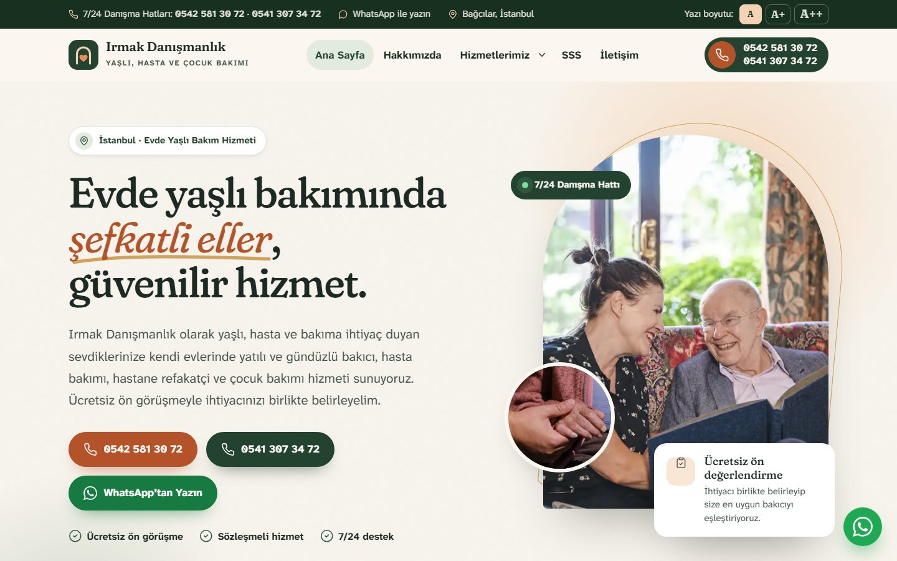
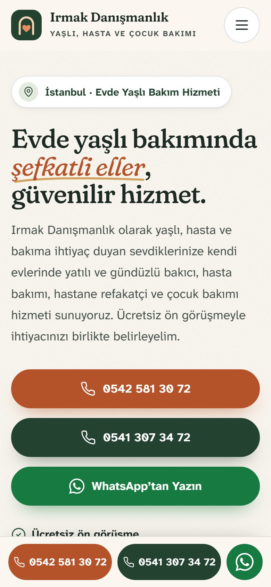

# Irmak Danışmanlık – Evde Yaşlı, Hasta ve Çocuk Bakımı Web Sitesi

İstanbul Bağcılar'da evde yaşlı bakımı, hasta bakımı ve çocuk bakımı hizmeti veren **Irmak Danışmanlık** için hazırlanmış, SEO uyumlu ve mobil uyumlu kurumsal web sitesi.

Site saf HTML, CSS ve JavaScript ile yazılmıştır. Veritabanı, PHP veya eklenti gerektirmez; `public_html` klasörünün içeriği her paylaşımlı hostinge (cPanel, Plesk vb.) doğrudan yüklenebilir.

<p align="center">
  
  &nbsp;
  
</p>

## Öne çıkan özellikler

- **14 sayfa:** her hizmet için Google'da ayrı aranabilen, kendi başlığı ve açıklaması olan sayfa
- **Yerel SEO:** işletme, hizmet, SSS ve sayfa konumu için yapılandırılmış veriler (Schema.org JSON-LD), site haritası, `robots.txt`, Open Graph paylaşım görseli
- **Yaşlı ziyaretçiler için erişilebilirlik:** yazı boyutu büyütme düğmeleri (A / A+ / A++), büyük dokunma alanları, görme güçlüğü olan okurlar için tasarlanmış *Atkinson Hyperlegible* yazı tipi, klavye ile gezinme ve "İçeriğe geç" bağlantısı
- **Telefon ve WhatsApp odaklı iletişim:** iki telefon numarası her zaman ekranda (masaüstünde üst menüde, mobilde alttaki sabit çubukta); iletişim formu bilgileri sunucuya göndermeden hazır bir WhatsApp mesajına dönüştürür
- **Hız:** WebP görseller, tembel yükleme, sunucuda barındırılan yazı tipleri, gzip sıkıştırma ve tarayıcı önbelleği (`.htaccess`)
- **Gizlilik:** üçüncü taraf takip kodu ve çerez yok; harita yalnızca ziyaretçi tıklayınca yüklenir; KVKK aydınlatma metni

## Sayfalar

| Sayfa | Dosya |
|---|---|
| Ana sayfa | `index.html` |
| Hakkımızda | `hakkimizda.html` |
| Hizmetlerimiz (karşılaştırma tablosuyla) | `hizmetler.html` |
| Evde Yaşlı Bakımı | `evde-yasli-bakimi.html` |
| Yatılı Yaşlı Bakıcı | `yatili-yasli-bakici.html` |
| Gündüzlü Yaşlı Bakıcı | `gunduzlu-yasli-bakici.html` |
| Evde Hasta Bakımı | `evde-hasta-bakimi.html` |
| Alzheimer ve Demans Bakımı | `alzheimer-demans-bakimi.html` |
| Hastane Refakatçi Hizmeti | `hastane-refakatci.html` |
| Çocuk Bakımı | `cocuk-bakimi.html` |
| Sıkça Sorulan Sorular | `sss.html` |
| İletişim | `iletisim.html` |
| KVKK Aydınlatma Metni | `kvkk.html` |
| Sayfa bulunamadı | `404.html` |

## Klasör yapısı

```
.
├── public_html/            Sunucuya yüklenecek site
│   ├── *.html              Sayfalar
│   ├── assets/css/         Stil dosyası (renkler :root içinde)
│   ├── assets/js/          Menü, yazı boyutu, WhatsApp formu, harita
│   ├── assets/fonts/       Fraunces ve Atkinson Hyperlegible Next (WOFF2)
│   ├── assets/img/         Optimize edilmiş görseller ve ikonlar
│   ├── .htaccess           HTTPS yönlendirme, önbellek, sıkıştırma, güvenlik başlıkları
│   └── sitemap.xml, robots.txt, site.webmanifest, favicon dosyaları
├── docs/                   README ekran görüntüleri
├── BILGILERI-DOLDUR.bat    Alan adını tüm sayfalara işleyen yardımcı araç (Windows)
├── bilgileri-doldur.ps1    Aracın PowerShell betiği
└── KURULUM-REHBERI.md      Adım adım kurulum ve yayına alma rehberi
```

## Kurulum

1. **Alan adını girin.** Site haritası ve Google bilgilerindeki alan adı `{{ALAN_ADI}}` olarak boş bırakılmıştır. `BILGILERI-DOLDUR.bat` dosyasına çift tıklayıp alan adını yazın veya tüm dosyalarda `{{ALAN_ADI}}` ifadesini alan adınızla değiştirin (örn. `irmakdanismanlik.com`).
2. **Yükleyin.** `public_html` klasörünün **içindekileri** hostinginizdeki `public_html` klasörüne yükleyin. Gizli `.htaccess` dosyası da dahil olmalıdır.
3. **Kontrol edin.** SSL sertifikasının aktif olduğundan, arama ve WhatsApp düğmelerinin çalıştığından emin olun.

Ayrıntılı anlatım, sorun giderme ve SEO önerileri için: **[KURULUM-REHBERI.md](KURULUM-REHBERI.md)**

Bilgisayarda önizlemek için `public_html/index.html` dosyasını tarayıcıda açabilir veya klasörde basit bir sunucu çalıştırabilirsiniz:

```bash
cd public_html
python -m http.server 8080
# Tarayıcıda: http://localhost:8080
```

## İletişim

**Irmak Danışmanlık** · Bağcılar, İstanbul

Telefon: [0542 581 30 72](tel:+905425813072) · [0541 307 34 72](tel:+905413073472) · WhatsApp: [0542 581 30 72](https://wa.me/905425813072)

## Lisans ve üçüncü taraf içerikler

- Site kodu ve metinleri © Irmak Danışmanlık. Tüm hakları saklıdır. Bu depo inceleme amacıyla herkese açıktır; içerik izinsiz kopyalanamaz veya başka bir işletme adına kullanılamaz.
- Fotoğraflar [Unsplash](https://unsplash.com) üzerinden, [Unsplash Lisansı](https://unsplash.com/license) kapsamında kullanılmıştır.
- Yazı tipleri ([Fraunces](https://fonts.google.com/specimen/Fraunces), [Atkinson Hyperlegible Next](https://fonts.google.com/specimen/Atkinson+Hyperlegible+Next)) [SIL Open Font License 1.1](https://openfontlicense.org) ile lisanslıdır; lisans metinleri `public_html/assets/fonts/` klasöründedir.
- İkonlar [Lucide](https://lucide.dev) (ISC Lisansı) ikon setinden uyarlanmıştır.
